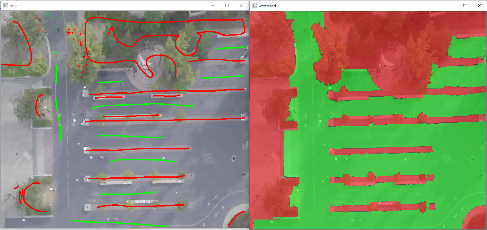
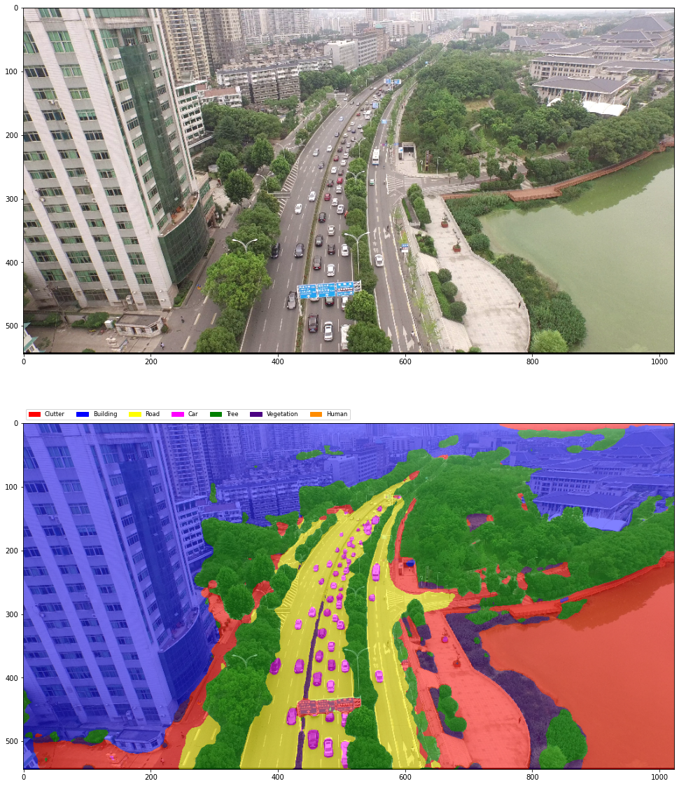
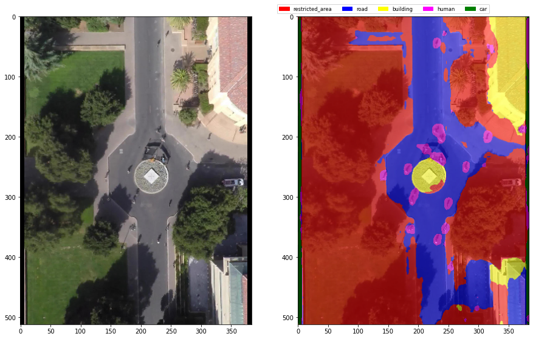
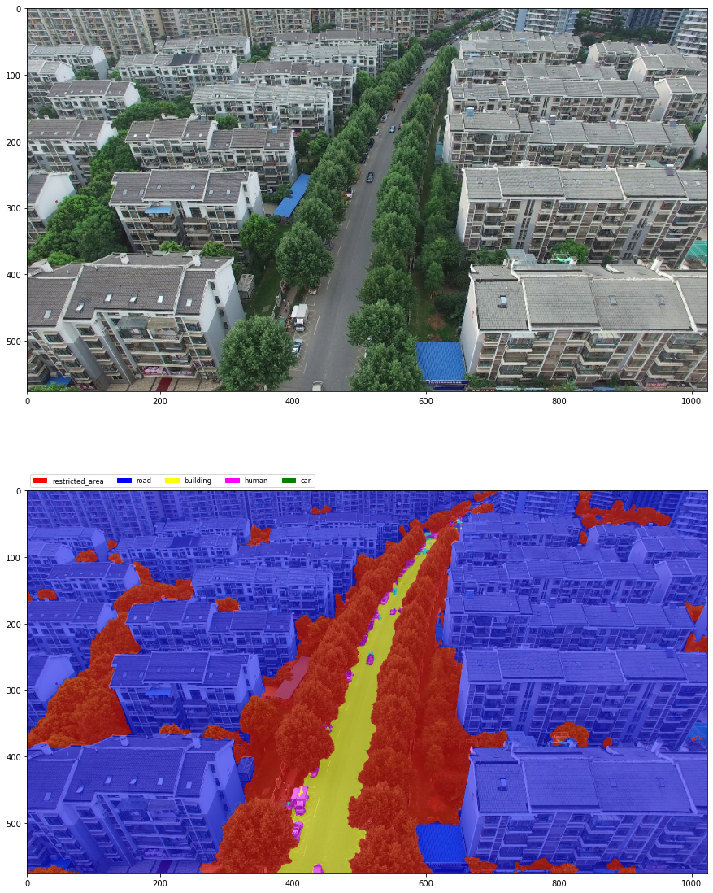
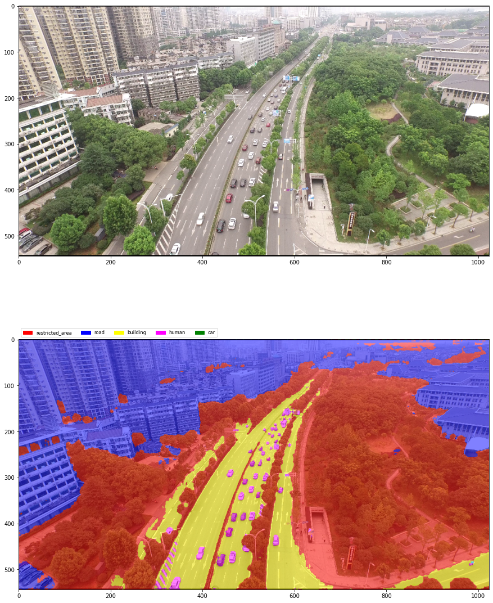
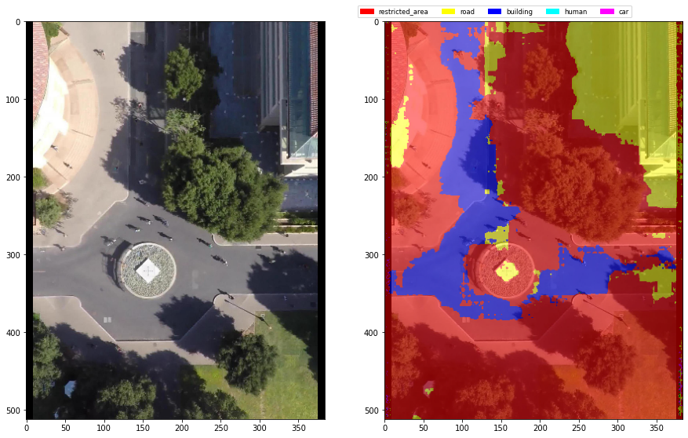
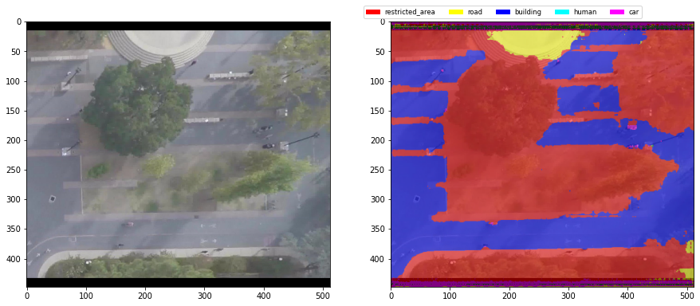
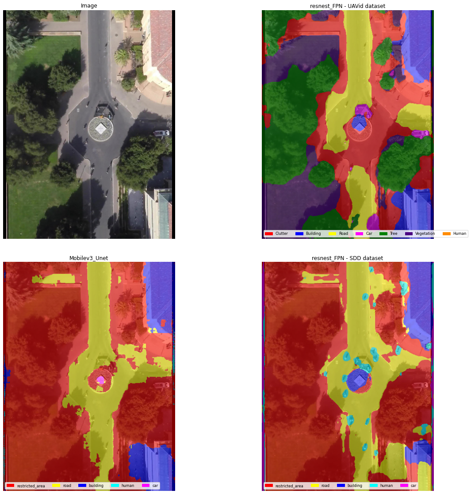

# Preamble
Поскольку у нас робот на колесиках, наверняка ему нужен класс с дорожным полотном - соответственно я могу натренить 3(2) класса - дорожное полотно, не-дорожное полотно (Бэкграунд), и различные движущиеся обьекты(люди, машины и т.д.). 
 

# Datasets
Поискал похожие датасеты, задачи на paperswithcode, для возможного расширения датасета. В основном, найденные датасеты не подошли по критерию вид не "сверху вниз" или слишком высоким пространственным разрешением картинки.
 

<b>urls:</b>
<li><a href="https://awesomeopensource.com/project/chrieke/awesome-satellite-imagery-datasets">Awesome Satellite Imagery Datasets</a>
<li><a href="https://www.dlr.de/eoc/en/desktopdefault.aspx/tabid-12760">Public Datasets</a>
<li><a href="https://lionbridge.ai/datasets/15-best-aerial-image-datasets-for-machine-learning/">15 Drone Datasets and Satellite Image Databases for Machine Learning</a>
<li><a href="https://www.kaggle.com/insaff/massachusetts-roads-dataset">Massachusetts roads dataset</a>
<li><a href="https://github.com/uverma/ManipalUAVid">ManipalUAVid</a> - прям то что нужно, пространственное разрешение + вид сверху, но все за стенами рисерча
<li><a href="https://github.com/dronedeploy/dd-ml-segmentation-benchmark">DroneDeploy Segmentation Dataset</a> - сейм
<li><a href="https://github.com/ishann/aeroscapes">Aeroscapes Datasets</a> 
<li><a href="https://www.kaggle.com/bulentsiyah/semantic-drone-dataset/tasks">Aerial Semantic Segmentation Drone Dataset</a>- высокое пространственное разрешение.
<li><a href="https://www.kaggle.com/dasmehdixtr/uavid-v1">UAVid Dataset</a> - из внешних использовал только этот
 

В целом, для обобщения модели можно было бы использовать все датасеты, но проблемы отсутствия разметки на пешеходов + каждый датасет по своему приготовлен.
# 
Решил что главный класс - разрешенная для движения местность, при этом если часть дороги закрывает дерево - значит мы не можем 100% быть уверены что там нет, например, пешехода. Поэтому сегментируем эту часть как "Restricted area".
Т.к. кадр в видео в основном статичный - рисую метки для одного кадра (референс) и считаю что на всех кадрах маска такая же (+всякие пешеходы и прочие "препятсвия").

Для разметки использовал watershed алгоритм по меткам.

  
Watershed

  лежит в <b>./watershedApp/watershedApp.py</b>
  

Поскольку дрон почти не движется - рисую маску для одного кадра (референс) и считаю что на всех кадрах маска такая же (+всякие пешеходы и прочие "препятсвия").
Предполагаю что нашему роботу пощволено двигатсья как по дорогам, так и по тротуару (включая ступеньки).

Использованный внешний датасет - UAVid: A Semantic Segmentation Dataset for UAV Imagery (домен не совсем такой же, но а вдруг?)
По результатам - классы 'Building', 'Car', 'Tree', 'Vegetation' хорошо обобщились на SDD датасет, но классы Human and Кoad - очень плохо, а они ключевые.

# Solution steps

1. Попробовал обучить сегментатор на UAVid датасете, на домене UAVid классы обучились хорошо (~0.8 IOU, кроме класса human - на нем все плохо, нужно большее разрешение при обучении или, лучше - учить keypoints как в CenterNet). На SDD в целом даже работает. Но из-за отсутствия теней в UAVid - в SDD на них ошибается.
Плоскую крышу дома часто принимает за часть дороги, или "Clutter" (аля пешеходная тропинка и проч.), да и в целом часто путает классы road и clutter на картинках SDD.
Ресайз_тактика - UAVid ресайз по большой стороне до 1024, и кропы по 512.

  
Results on UAVid

  

  
Results on SDD

  
  

2. Обучаю модель на автоматически размеченных (watershed'ом и вручную нарисованными маркерами) классах "Restricted area" - деревья, трава, кусты, всякие препятсвия, "road" - асфальтированная дорога, "buildings". 
А также разметке из датасета, обьединный класс "human" (Pedestrian, Biker, Skater) и "car" (Cart, Car, Bus). Всего 5 классов.
Ресайз_тактика - SDD ресайз до 512, кропы по 320.

  
Results on SDD

  

3. Модель из п.2 ошибается в областях теней (нкужно добавить таких аугов), и на машинах (нужно стратифицированно семплироваться по фоткам с машинками). 
В качестве решения обучусь сначала на UAVid с аугами теней (и не надо стратифицированно семплиться, т.к. там машин оч много).

Обьединю классы Tree, Vegetation и Clutter в 1 класс.
В GT UAVid Сделаю маски людей потолще, чтобы приблизиться к разметке в SDD. И учусь на общем датасете (с семплером, чтобы картинки в даталоадере появлялись 50 на 50).
Так же сменил архитектуру на MobileUnet_v3. 
Ресайз_тактика - UAVid ресайз по большой стороне до 1024, и кропы по 512. SDD ресайз до 512, без кропов. 

  
Results on UAVid

  
  

  
Results on SDD

  
  

# Results
Поскольку разметка для классов "road", "restricted", "building" генерировалась находу watershed'ом, по размеченным мною меткам - решение о лучшей модели буду принимать на основе разметки SDD  датасета. 
Хоть bboxes обхватывают класс 'humans' очень слабо, тем не менее всам обьект лежит внутри ббокса, а значит положительный IOU (GT и Predict) будет хоть как-то сообщать об успешной сегментации 'Human'.

На лучшей модели IOU по классам - {'restricted_area': 0.8316261, 'road': 0.69567996, 'building': 0.57528985, 'human': 0.26664507, 'car': 0.04435627}. Эта модель училась только на датасете SDD, из чего я делаю вывод что домены с UAVid слишком отличаются.
Для улучшения сегментации по классу 'human' - можно обучать модель с входом на 3 последовательных кадра ("до", "сейчас", "после"), где эти самые humans будут двигаться, пока сама сцена - нет. 
Аналогично с машинами, но тут больше повлияет стратифицированное семплирование во время обучения, т.е. в батчи подмешивать кадры, содержащие машинки почаще.

  
Results

  

